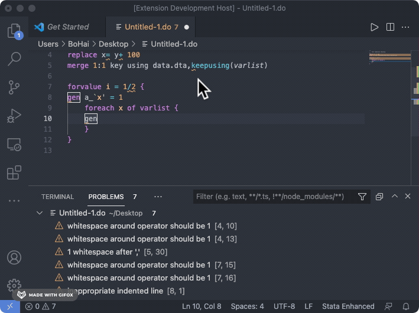
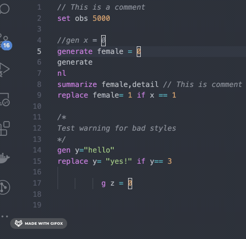
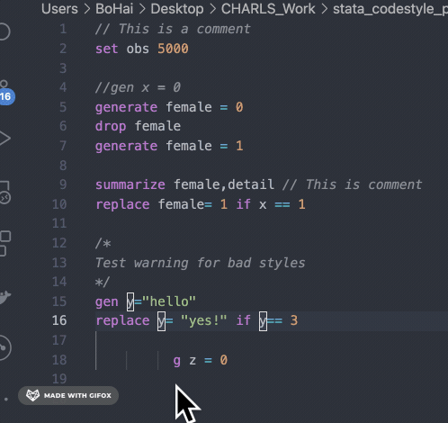
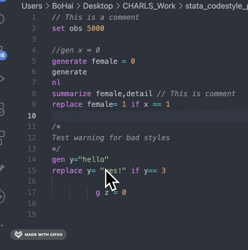

# Stata-Language-Server

> Write your Stata scripts more fluently!

## Description

An extension for [Stata](https://www.stata.com/) on VS Code. It provides codestyle checking, goto-definition, syntax tips and auto completion.

Developed based on [language server](https://microsoft.github.io/language-server-protocol/), depending on Third-party Python library [pygls](https://github.com/openlawlibrary/pygls).

> Note: Python(>=3.6) is required on local system before extension installing. Another extension [Stata Enhanced](https://marketplace.visualstudio.com/items?itemName=kylebarron.stata-enhanced) is recommanded for syntax highlight since Stata Language Server doesn't provide this feature.

## Supported Features

- Codestyle Checking

    When editing a stata do-file, the extension will check documents and show bad codestyle using wavy underlines.

    

- Syntax tips while hovering

    When hovering on a complete command, a markdown formatted Syntax Description will appear.

    > Note: Not available for 1.abbr. commands(eg: `g`, `gen`); 2.docstring included in another command's docstring(eg: `replace` belongs to `generate`)

    

    > Note: Docstring files of this extension are only for academic purpose. The original work copyright belongs to StataCorp LLC. See ThirdPartyNotices.txt for details.

- Goto Definition(`generate varname =`)

    Find and jump to the last `generate` place when right-click a variable name and click `Go to Definition`. Can match pattern like `g(enerate)`.

    

- Syntax auto completion

    Auto-Completion for most stata commands. Only support complete syntax(eg: `generate`, not `g(enerate)`).

    

## Requirements

- Python >= 3.6

> Note: The extension takes the value(default `python`) of `python.pythonPath` in VSCode's Settings as the running version. You may check that terminal command `python` are correctly linked to v3.6 or later, or change the path to a full path in VSCode.

## Settings

| Setting Name | Description | Default Value |
|---|---|---|
| `stataServer.setMaxLineLength` | Max line length for codestyle checking | `120` |
| `stataServer.setIndentSpace` | Indent spaces for codetyle checking | `4` |
| `stataServer.enableCompletion` | Turn on/off auto-completion | `true` |
| `stataServer.enableDocstring` | Turn on/off docstring tips | `true` |
| `stataServer.enableStyleChecking` | Turn on/off codestyle checking | `true` |

## Release Notes

Refer to [CHANGELOG.md](https://github.com/HankBO/stata-language-server/blob/main/CHANGELOG.md)

## Issues

Submit [issues](https://github.com/HankBO/stata-language-server/issues) if you find any bug or have any suggestion.
